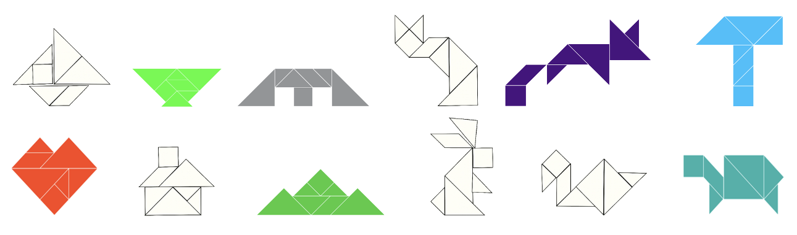
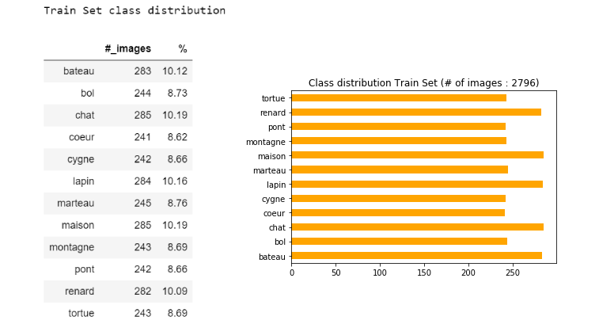
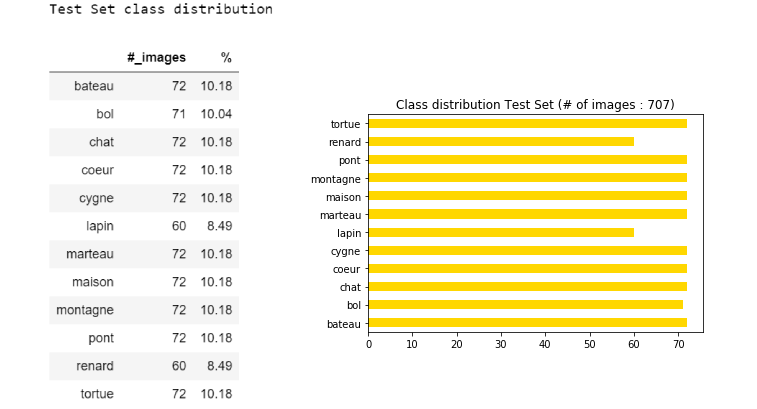
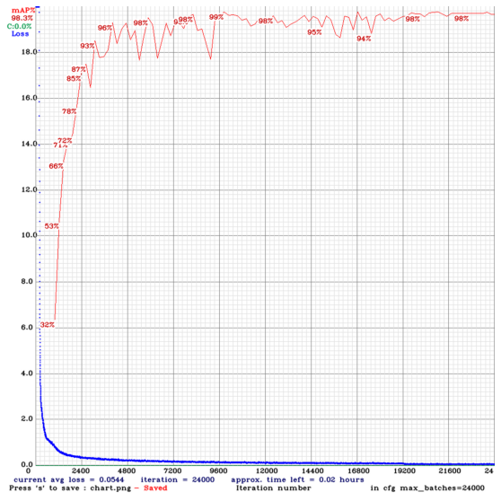
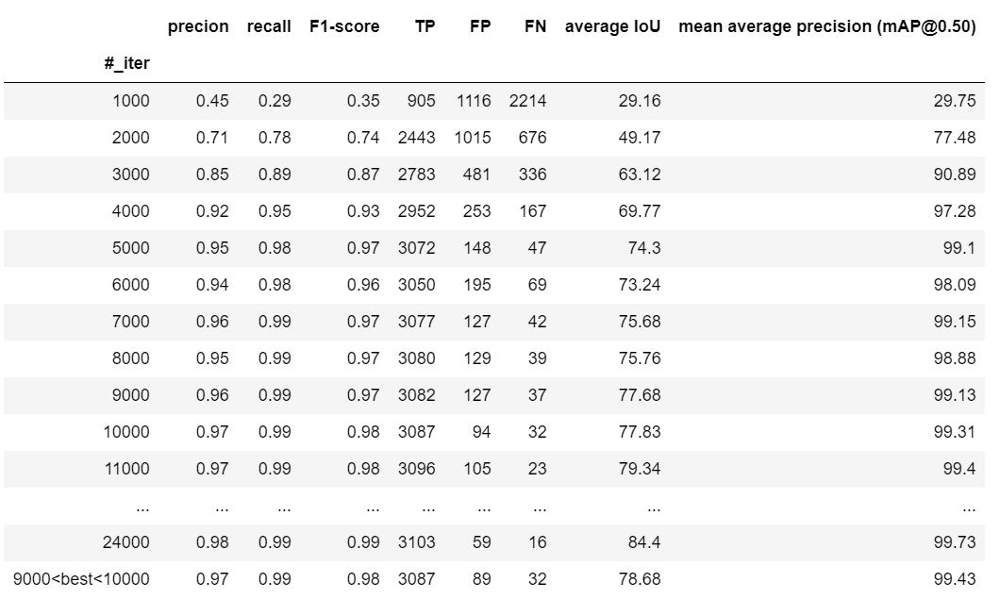
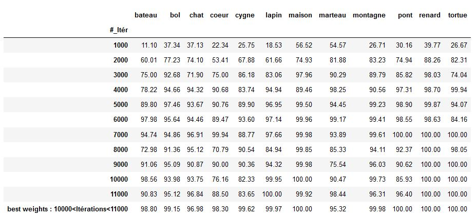
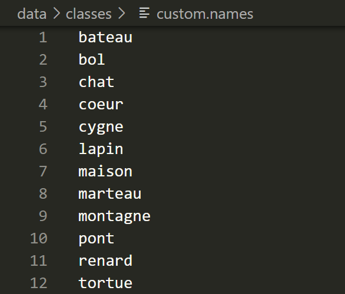
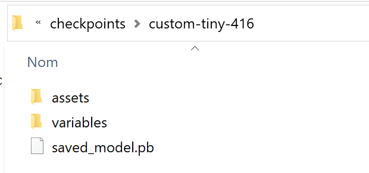

READ.ME


# TangrIAm Project 
The project is partnership between Exploradôme museum, OCTO Technology and Microsoft and it aims to introduce the concept and application of artificial intelligence to young children (6-year-old).

The specific application developed for the project is to apply object detection to live tangram solving.

A tangram is a dissection puzzle consisting of 7 flat polygons (5 triangles, 1 square and 1 parallelogram) which are combined to obtain a specific shape. 

Within the framework of the project, 12 tangram selected shapes act as classes for the object detector:

```bash
- boat (bateau)
- bowl (bol)
- bridge (pont) 
- cat (chat)
- fox (renard) 
- hammer (marteau) 
- heart (coeur)
- house (maison) 
- mountain (montagne) 
- rabbit (lapin)
- swan (cygne)
- turtle (tortue)
```

<p align="center"></p>

## Objective

The project objective is to train a YOLOv4 model to provide accurate predictions when identifying the detected shape of the tangram while live solving the puzzle.

# Data 

## 1. Video recording :
The first step in collecting data was to record a video sample of tangram solving. 

## 2. From video stream to images

Further on, extract representative frames of the 12 shapes/classes and annotate the position of the object of interest within the frame.

This was done by:
- taking screenshots of each shape from the video recorded
- using a python code that takes snapshots of the video every 3 seconds

## 3. Image annotation

Two methods were tested:

- labelImg (rectangle around the object)
- VIA VGG Image Annotator (object outlines)

LabelImg showed better performance.

From the video, screenshots of the classes were done using two strategies, ie, a perfect version of the figure and an imperfect version of the figure containing white spaces between the tangrams.

### Guidelines for using image annotations using labelImg

#### Installation
Two installation methods are possible:

 1. Go through the source code following the tutorial available at this GitHub link: https://github.com/tzutalin/labelImg)
 2. Download the .exe and launch the application directly from desktop (download link https://tzutalin.github.io/labelImg/)
    
```python
#### Installation for Mac

brew install qt  # Install qt-5.x.x by Homebrew
brew install libxml2

or using pip

pip3 install pyqt5 lxml # Install qt and lxml by pip

make qt5py3
python3 labelImg.py
python3 labelImg.py [IMAGE_PATH] [PRE-DEFINED CLASS FILE]
```

```python
#### Installation for Windows

pyrcc4 -o lib/resources.py resources.qrc
For pyqt5, pyrcc5 -o libs/resources.py resources.qrc

python labelImg.py
python labelImg.py [IMAGE_PATH] [PRE-DEFINED CLASS FILE]
```

#### Labeling with YOLO text file format

- Define the classes list to be used for training in `data/predefined_classes.txt`
- Launch labelImg.py
- Right below the "Save" button in the toolbar, click "PascalVOC" button to switch to YOLO format
- Use Open/OpenDIR to process single or multiple images
- When finished with a single image, click "Save"
    - A YOLO format txt file will be saved in the corresponding folder of homonymous image
    - A file named `classes.txt` is equally saved to the respective folder. The file `classes.txt` lists the class names that the YOLO label refers to.

## 4. Building a dataset

Dataset size before data augmentation:

-  134 labeled images with corresponding `.txt` files in YOLO format (label and bounding box coordinates) 

The dataset was split in a train dataset with 69 images and a test dataset with 59 images before applying data augmentation:

<p align="center"></p>

## 5. Data augmentation 

Data augmentation is a way to increase the size of available data, instead of adding new data.

For this purpose, within the scope of the project data augmentation was performed with Roboflowai. Roboflow which allows several image transformations, such as: blur, rotation, shear, exposure, brightness, noise.

A mix of above-mentioned transformation was used to augment the dataset.


### Steps

To perform data augmentation with Roboflow while minding the YOLO format, the following steps were performed:

1. Create a [Roboflow](https://app.roboflow.ai/) account
2. Create a "Dataset" using "Object Detection" (Bounding Box) as type
3.	Upload the images and their annotations (e.g. VOC XML, COCO JSON, TensorFlow Object Detection CSV formats)
4.	Once uploaded, select preferred preprocessing steps. We recommend auto-orient and resize to 416x416
5. Add "Augmentation Options"
6. Click "Generate"
7. Select `YOLO Darknet` as format and show download code
8. Choose a link to download via terminal or jupyter notebook

The following augmentations options randomly were applied to images in the training dataset:

- Flip (vertical and horizontal)
- 90° rotate (counter, clockwise, upside, down)
- Rotation every 5° up to 45°
- Crop : 20% 
- Brightness : 5% and 10%
- Exposure: 12% and 25%
- Blur : 3px and 1.25px
- Noise: 5px and 2px

For the test dataset the augmentation options are listed below:

- Flip (vertical and horizontal)
- 90° rotate (counter, clockwise, upside, down)
- Rotation 5°, 15° and 30%
- Brightness : 5% and 10%

### Data size after data augmentation
3503 images, of which:

- 2796 images for the training dataset (~ 80%)
- 707 images for the test dataset (~ 20%)

<p></p>

<p></p>


# Model training: YOLOv4 tiny
We choose to implement the tiny version of YOLOv4 on the dataset for much faster training and much faster detection.

The primary difference between YOLOv4 tiny and YOLOv4 is that the network size is dramatically reduced. The number of convolutional layers backbone are compressed (137 for yolov4 vs 29 for yolov4 tiny). The number of YOLO layers are two instead of three and there are fewer anchor boxes for prediction. The differences between the two networks can be noted in the config files:
- [yolov4-tiny.cfg](https://raw.githubusercontent.com/AlexeyAB/darknet/master/cfg/yolov4-tiny.cfg)
- [yolov4-tiny](https://raw.githubusercontent.com/AlexeyAB/darknet/master/cfg/yolov4.cfg)
YOLOv4 tiny performance was equally tested on coco dataset. In all, YOLOv4 tiny inference time is roughly 8x faster compared to YOLOv4 and its performance is roughly 2/3 that of YOLOv4 on MS COCO). On small custom detection tasks that are more tractable, there is less performance degradation.

The YOLOv4 Darknet (from AlexeyAB's GitHub repository) was trained using Google Colab. This option facilitates model deployment and rapid training while providing free GPU usage.  The model training is inspired by the respective tutorial of "the AI GUY":

-  Colab link on how to Train YOLOv4 and YOLOv4 tiny Custom Object Detector : https://colab.research.google.com/drive/1_GdoqCJWXsChrOiY8sZMr_zbr_fH-0Fg?usp=sharing#scrollTo=qaONUTI2l4Sf, https://colab.research.google.com/drive/1PWOwg038EOGNddf6SXDG5AsC8PIcAe-G#scrollTo=nBnwpBV5ZXxQ
-  Youtube link for building and training Custom Object Detector : https://www.youtube.com/watch?v=mmj3nxGT2YQ
-  Github link of YOLOv4 cloud tutorial: https://github.com/theAIGuysCode/YOLOv4-Cloud-Tutorial/tree/master/yolov4

The Google Colab notebook of our tangram model training is available on this link: 
https://colab.research.google.com/drive/1-SU3dltpVubOOeyuaBgCNdPsHaIqlfI2?usp=sharing

### 1. Setting up
Custom YOLOv4 tiny detector training setup follows the same steps as for YOLOv4, it requires :

- A labeled custom dataset in the YOLO Darknet format: each image has to have a corresponding `.txt` file with the object label and the object bounding box coordinates (e.g label coord_1 coord_2 coord_3 coord_4)
- A custom `.cfg` file
- `obj.data` and `obj.names` files
- A `train.txt` file (`test.txt` is optional)
- Downloading of the yolov4-tiny weights
```python
# download the newly released yolov4-tiny weights
%cd /content/darknet
!wget https://github.com/AlexeyAB/darknet/releases/download/darknet_yolo_v4_pre/yolov4-tiny.weights
!wget https://github.com/AlexeyAB/darknet/releases/download/darknet_yolo_v4_pre/yolov4-tiny.conv.29
```

The required configuration files in the local `darknet` drive are shown in the image below : 


A cheat sheet is available [here](http://blog.ibanyez.info/download/B20190410T000000072.png).

#### the `.cfg` (configuration) file

The `.cfg` file named "custom-yolov4-tiny-obj.cfg" was edited to include the number of classes (12 different tangram shapes) used for the project. According to the model developer’s tutorial, the first lines of the `.cfg` file were modified to following:

```bash
batch = 64 
subdivisions = 16
width = 416 (our image width)
height = 416 (our image height)

max_batches = 24000   # ie :  (# of classes) * 2000 (but no less than 6000 so if you are training for 1, 2, or 3 classes it will be 6000, here detector for 12 classes gives a max_batches=24000) 
steps = 19200,21600  # ie: 80% of max_batches, 90% of max_batches (so here our max_batches = 24000)
```

Next, `classes = 12` was included in the two YOLO layers (ie: line 220 and line 268) and `filters = 51` in the two convolutional layers before the YOLO layers (ie: lines 212 and line 262). 

The `filters` parameter is set based of the following formula:  filters = (# of classes + 5) * 3 (so if you are training for one class then your filters = 18, but if you are training for 12 classes then your filters = 51).

**Optional:** When running into memory issues or finding the training taking a super long time, change one line from random = 1 to random = 0 in each of the two YOLO layers in the `.cfg`, to speed up training, however, at the expense of the accuracy of model. This trick will also help save memory if you run into any memory issues.

#### `obj.names` and `obj.data` files

  A `obj.names` file is created to include one class name per line in the same order as the `_darknet.labels` file generated by Roboflow:

```bash
bateau
bol
chat
coeur
cygne
lapin
maison
marteau
montagne
pont
renard
tortue
```

NOTE: There should be no spaces in the class names.

  A `obj.data` file was created with the following code, including the number of classes, as well as the backup location (this backup folder will serve to save the weights of the model at different iteration times during training):

```bash
classes = 12
train =  data/train.txt
valid =  data/test.txt
names = data/obj.names
backup = /mydrive/DeepL/Projet_tangram/backup_TINY
```

#### `train.txt` and `test.txt`

The last configuration files needed before custom training the detector are `train.txt` and `test.txt` files which include the relative paths to all training images and validation images.

"The AI GUY" tutorial provides scripts to easily generate these two files with the image folder paths. The respective scripts are `generate_train.py` and `generate_test.py`.

The complete `darknet` folder including the custom files were uploaded to Google Drive mounted in Google Colab notebook.

### 2. Training

The model trained for over 24000 iterations (it takes ~ 4/5 hours). The `custom-yolov4-tiny-obj_"nb_iter".weights` files were automatically saved every 1000 iterations on Google Drive.  In addition, a `custom-yolov4-tiny-obj_best.weights ` file, corresponding to weights with the highest mAP, is automaticcally saved.
Note : if Google Colab runtime getting disconnected, the model is able to continue training from the latest checkpoint using the saved weights in `yolov4-obj_last.weights`. 

```python
!./darknet detector train data/obj_TINY.data cfg/custom-yolov4-tiny-obj.cfg yolov4-tiny.conv.29 -dont_show -map
```
After training, we obtained a chart of our average loss vs. iterations. For a model to be 'accurate', it is recommanted to aim for a loss under 2.

<p align="center" title="Test"></p>

### 3. Mean Average Precision (mAP)
The Mean Average Precision (mAP) of our Model  was checked  by runnning the following command :

```python
!./darknet detector map data/obj_TINY.data cfg/custom-yolov4-tiny-obj.cfg /mydrive/DeepL/Projet_tangram/backup_TINY/yolov4-tiny-obj_1000.weights
```

We ran it on multiple of the saved weights to compare and find the weights with the highest mAP as that is the most accurate one. 
NOTE: It is important to run the mAP commandson multiple of the saved weights to see if one of the previously saved weights is a more accurate model in case of final weights file has overfitted

The table below shows from 1000 to 24000 iterations, all metrics are increasing. At the end of the training process mAP  rises to 0.98. The mAP overall best result (around 99%) is obtained between iterations 9600 to 10000. But to avoid overfitting, we decided to use the 3000 iterations saved weight file afterwards. 

**MAPs on the TRAIN set:**
<p align="center" title="Test"></p>


**MAPs on the TEST set:**
<p align="center" title="Test"></p>

**Class precision on the TEST set:**
<p align="center"></p>


#  YOLOv4 tiny using TensorFlow 

**Note: Performance** Check out how YOLOv4 compares to other object detection systems
<p align="center"></p>
[](LICENSE)

To implement YOLOv4-tiny in Tensorflow 2.0, first convert YOLOv4 tiny .weights into the corresponding TensorFlow model (`.pb` format) and then run the model.

Here the different steps to do so:

## Getting Started
### 1. Cloning the "AI GUY" repository : https://github.com/theAIGuysCode/yolov4-custom-functions 
### 2. Creating a working environnemnent 
#### Conda (Recommended)
```bash
# Tensorflow CPU
conda env create -f conda-cpu.yml
conda activate yolov4-cpu

# Tensorflow GPU
conda env create -f conda-gpu.yml
conda activate yolov4-gpu
```
#### Pip

```bash

# Create a pip env on the cloned githud folder
py -m pip install --user virtualenv
py -m venv yolov4-gpu
.\yolov4-gpu\Scripts\actvate # on windows

# TensorFlow CPU
pip install -r requirements.txt

# TensorFlow GPU
pip install -r requirements-gpu.txt
```

**Note** : If you are using GPU with CUDA 10.1 version. Install tensorflow-gpu==2.1.0 instead of tensorflow-gpu==2.3.0rc0 as written in the requirements-gpu.txt.


### Nvidia Driver (for GPU, if you are not using Conda Environment and have not set up CUDA yet)

Make sure to use CUDA Toolkit version 10.1 as it is the proper version for the TensorFlow version used in this repository: https://developer.nvidia.com/cuda-10.1-download-archive-update2


## Using custom trained YOLOv4 weights

<strong>Note:</strong>  To use our own weights:
- rename best weights file to 'custom.weights' and paste it into the 'data/' folder.

- Paste the custom.names file into the `data/classes/` folder : 
<p align="center"></p>

- Change line 14 of `core/config.py` file to point at the custom.names file:
<p align="center"></p>

**Note** <a href="https://github.com/Lucile-S/exploradome_tangram/blob/yolo---team1/data/custom.weights"> Here is the tiny yolov4 custom weight (`custom.weights`) file that is present in the ./data folder</a>

## 2. Convert darknet YOLOv4 tiny weights to TensorFlow 

```bash 
# custom.weights : finally selected weight file
python save_model.py --weights ./data/custom.weights --output ./checkpoints/custom-tiny-416 --input_size 416 --model yolov4  --tiny
```
The resulting `.pb` model is saved in the `./checkpoints/custom-tiny-416`  directory :
<p align="center"></p>

## 3. Run YOLO4 tiny TensorFlow model
### On image

```bash
# Run yolov4-tiny tensorflow model
python detect.py --weights ./checkpoints/custom-tiny-416 --size 416 --model yolov4 --images ./data/images/maison_3.png --tiny
```

### On video

```bash
# Run custom yolov4 model on video
python detect_video.py --weights ./checkpoints/custom-tiny-416 --size 416 --model yolov4 --video ./data/video/tangram_video.mp4 --output ./detections/results.avi --tiny
```
### On  webcam

```bash
# Run yolov4 on webcam
python detect_video.py --weights ./checkpoints/custom-tiny-416 --size 416 --model yolov4 --video 0 --output ./detections/results.avi --tiny
```

## 4.  Result Video


The output video will be saved wherever the --output flag points to. By default (in the absence of a flag), the video will not be saved.

<p align="center"></p>

**FPS** : around 25 FPS using GeForce (version 451.67) GPU  on a windows Surface laptop and xx using cpu

# Detailed Info About Tangram Detection : bounding box coordinates, classe probabilies

```bash
# Run yolov4 on webcam
python detect_video.py --weights ./checkpoints/custom-tiny-416 --size 416 --model yolov4 --video 0 --output ./detections/results.avi --tiny
```

We added to detect_video.py a custom flag called `output_file` in order to ouput an external file (named `./detections/boxes_and_predictions.txt`by default). 
This file contains, for each frame of the video, a list of dictionnaries (`object position and object prediction`) with detected trangram bounding box coordinates (upper left and  bottom right corner points ; in units of number of pixels) and associated classe probabilies. 
In addition, a flag  `sort_by`  allow to sort the predictions by descending order and keep a specified number (`max_classes` variable) of classes.

Example of the output file from one frame with 2 tangrams detected using the `sort_by 5` option that returns the top 5 classe propabilies : 
```bash
python detect_video.py --weights ./checkpoints/custom-tiny-416 --size 416 --model yolov4 --video ./data/video/test_tangram_5.mp4  --tiny --sort_by 5
```
```
[{'object_position': {'x1': 237.0, 'y1': 331.0, 'x2': 558.0, 'y2': 596.0}, 'object_prediction': {'maison': 99.86477540058777, 'marteau': 0.0528011213493851, 'bol': 0.03359513523064186, 'montagne': 0.01354623555080417, 'coeur': 0.008174154976000441}}, {'object_position': {'x1': 1035.0, 'y1': 191.0, 'x2': 1361.0, 'y2': 489.0}, 'object_prediction': {'bateau': 92.25971970012176, 'montagne': 7.287678893676028, 'coeur': 0.1565047711833095, 'bol': 0.1486034053909359, 'renard': 0.05554839096459371}}] 
````

to your command prompt just add the flag "--info" to any of your commands. The information on each detection includes the class, confidence in the detection and the bounding box coordinates of the detection in xmin, ymin, xmax, ymax format.


## Command line argument references

```bash
save_model.py:
  --weights: path to weights file
    (default: './data/yolov4.weights')
  --output: path to output
    (default: './checkpoints/yolov4-416')
  --[no]tiny: yolov4 or yolov4-tiny
    (default: 'False')
  --input_size: define input size of export model
    (default: 416)
  --framework: what framework to use (tf, trt, tflite)
    (default: tf)
  --model: yolov3 or yolov4
    (default: yolov4)

detect.py:
  --images: path to input images as a string with images separated by ","
    (default: './data/images/kite.jpg')
  --output: path to output folder
    (default: './detections/')
  --[no]tiny: yolov4 or yolov4-tiny
    (default: 'False')
  --weights: path to weights file
    (default: './checkpoints/yolov4-416')
  --framework: what framework to use (tf, trt, tflite)
    (default: tf)
  --model: yolov3 or yolov4
    (default: yolov4)
  --size: resize images to
    (default: 416)
  --iou: iou threshold
    (default: 0.45)
  --score: confidence threshold
    (default: 0.25)
    
detect_video.py:
  --video: path to input video (use 0 for webcam)
    (default: './data/video/video.mp4')
  --output: path to output video (remember to set right codec for given format. e.g. XVID for .avi)
    (default: None)
  --output_format: codec used in VideoWriter when saving video to file
    (default: 'XVID)
  --[no]tiny: yolov4 or yolov4-tiny
    (default: 'false')
  --weights: path to weights file
    (default: './checkpoints/yolov4-416')
  --framework: what framework to use (tf, trt, tflite)
    (default: tf)
  --model: yolov3 or yolov4
    (default: yolov4)
  --size: resize images to
    (default: 416)
  --iou: iou threshold
    (default: 0.45)
  --score: confidence threshold
    (default: 0.25)
```


# References
  
  * tensorflow-yolov4-tflite [YOLOv4] from theAIGuysCode
  * (https://github.com/theAIGuysCode/tensorflow-yolov4-tflite)
  * YOLOv4: Optimal Speed and Accuracy of Object Detection [YOLOv4](https://arxiv.org/abs/2004.10934).
  * [darknet](https://github.com/AlexeyAB/darknet)
  * [Yolov3 tensorflow](https://github.com/YunYang1994/tensorflow-yolov3)
  * [Yolov3 tf2](https://github.com/zzh8829/yolov3-tf2)
