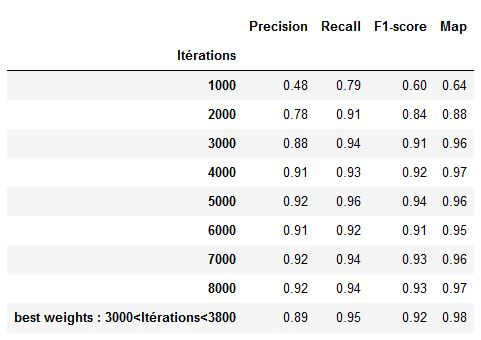
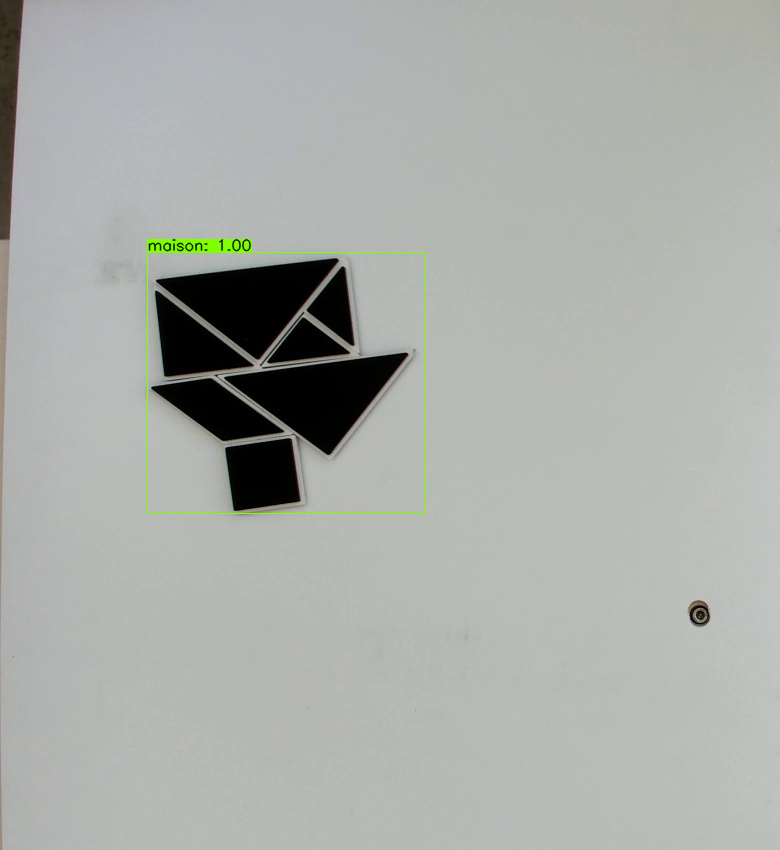

READ.ME


Exploradome's project is about an educational game for 6-year-old children. 

Their ambition is to awaken children's interest about the future with object recognition and computer vision in a fun and educational way through a tangram game.

Our duty is to design an algorithm which will be able to determine the percentage of completeness of the given figure. 

Thus the child will be able to see if he has more or less succeeded in achieving the figure he had to do.


Therefore Exploradome provided us with a camera as well as the game table with the 12 tangrams.


The tangrams are made with 7 parts :

- 5 triangles, 

- 1 square, 

- and 1 parallelogram


When you put them together, it creates 12 shapes :

boat, bowl, cat, heart, swan, rabbit, house, hammer, mountain, bridge, fox, turtle


## Objective

The objective of this project is to train a YOLO v4 model to recognize in real time the realization of tangram (record in live and make by children) and to make predictions on the realized shapes.


## Video recording :

The first step was to create our image classification, so we had to determine the 12 possible figures and annotate them. To do this, we decided to film continuously (using the camera provided by exploradome to respect the conditions under which the algorithm will be used) members of our team performing in turn the 12 possible figures.


## Cut video into photos


For cutting the video into images, we proceeded in different ways:

- screenshots of the video with separate figures

- python code for cutting the video every 3 seconds then manual sorting

- video cutting test with the FreeVideo to JPG application (cut every 5 secondes)


Methods retained :

- screenshots and cutting with python and manual sorting


## Image annotations

We tested 2 methods :

- labelImg (rectangle around the object)

- VIA VGG Image Annotator (object outlines)

  

Method adopted :

labelImg


From this video we took screenshots of the classes in two versions, a perfect version of the figure and an imperfect version of the figure with the tangrams peeled off. Once done, we had to label
our images. For that we used labelImg which is an image annotation tool. So we used two ways to proceed one is to go through the source code (tutorial available at this github link: https://github.com/tzutalin/labelImg), , the other is to download the .exe and launch the application directly from your desktop (download link  https://tzutalin.github.io/labelImg/)


#### LabelImg

LabelImg is a graphical image annotation tool.

https://github.com/tzutalin/labelImg

```
Installation for Mac

brew install qt  # Install qt-5.x.x by Homebrew
brew install libxml2

or using pip

pip3 install pyqt5 lxml # Install qt and lxml by pip

make qt5py3
python3 labelImg.py
python3 labelImg.py [IMAGE_PATH] [PRE-DEFINED CLASS FILE]
```


#### Steps (YOLO)
In data/predefined_classes.txt define the list of classes that will be used for your training.
Launch labelImg.py.
Right below "Save" button in the toolbar, click "PascalVOC" button to switch to YOLO format.
Use Open/OpenDIR to process single or multiple images. When finished with a single image, click save.
A txt file of YOLO format will be saved in the same folder as the image with same name. A file named "classes.txt" is saved to that folder too. "classes.txt" defines the list of class names that the YOLO label refers to.


## Initial Dataset

Choice of images for the initial dataset of labeled images before data augmentation:

- 55 labeled images thanks to LabelImg

  


## Data augmentation, split of the dataset

Why is data augmentation needed?

Data augmentation is a strategy to increase the diversity of data available for training models, without actually collecting new data.


In order to train our model on a consistent dataset and avoid over-training, we decided to do a data augmentation with Roboflowai. For this, we used Roboflow which allows several transformations of the images, such as: blur, rotation, shear, exposure, brightness, noise, blur. 

Every group member did its own mix of transformation. 

We decide to split the dataset like : 80% for training dataset, and 20% for test dataset


### Steps

To import our images and bounding boxes in the YOLO Darknet format, we'll use Roboflow.

1. To get your data into Roboflow, create a free [Roboflow](https://app.roboflow.ai/) account.
2. Create Dataset using Object Detection (Bounding Box) as type.
3. Upload your images and their annotations in any format (VOC XML, COCO JSON, TensorFlow Object Detection CSV, etc).
4. Once uploaded, select a couple preprocessing steps. We recommend auto-orient and resize to 416x416
5. Add some Augmentation Options
6. Click "Generate"
7. Select YOLO Darknet as format and show download code
8. Choose any link to download via terminal or jupyter notebook

For our dataset we did five times different Augmentation Options to obtain more images.

- Crop : 28% , Brightness : 25%, Exposure: 15%, Blur : 4.25px, Noise: 5%
- Crop: 22%, Rotation: 9°, Brightness: 17%: Exposure: 30%, Blur: 2px, Noise: 1%
- Crop: 25%, Rotation: 25°, Brightness: 30%, Blur: 2.75px, Noise: 20%
- Flip: Horizontal ; Vertical, 90° Rotate: Clockwise ; Counter-Clockwise ; Upside Down, Crop: 31%, Rotation: 45°, Brightness: 40%, Exposure: 32%, Blur: 5.5px, Noise: 14%
- Crop: 10%, Rotation: 19°, Shear: 15°, Brightness: 6%, Exposure: 22%, Blur: 3.25px, Noise: 3%


## Dataset after data augmentation : 
2034 images : 

- 1878 images for the training dataset
- 156 images for the test dataset

## YOLOv4 training on our Tangram dataset

For that purpose we used YOLOv4 Darknet (from AlexeyAB's Github repository) in the Cloud through Google Colab. We decided to work on Google Colab because it offers free gpu and the installation of yolov4 darknet is easy. We followed the step-by-step walkthrough tutorial of "the AI GUY" :
-  https://colab.research.google.com/drive/1_GdoqCJWXsChrOiY8sZMr_zbr_fH-0Fg?usp=sharing#scrollTo=qaONUTI2l4Sf
-  https://www.youtube.com/watch?v=mmj3nxGT2YQ
-  https://github.com/theAIGuysCode/YOLOv4-Cloud-Tutorial/tree/master/yolov4

Here is the Colab Notebook for showing how we trained our YOLOv4 Tangram detector : 

In order to create a custom YOLOv4 detector we  needed the following:

- Labeled Custom Dataset in the yolo darknet format : each image need to have a corresponding txt file containning the label object following by the label object bounding box coordinates (ie : label coord_1 coord_2 coord_3 coord_4)
- Custom .cfg file
- obj.data and obj.names files
- train.txt file (test.txt is optional here as well)

### the cfg (configuration) file
We edit the cfg file named "yolov4-obj.cfg" based on how many classes we are training.
Following the recommandations of the tutorial we changed the first lines of the file as follow : 

batch = 64 
subdivisions = 16
width = 416 (our image width)
height = 416 (our image height)

max_batches = 24000   ie :  (# of classes) * 2000 (but no less than 6000 so if you are training for 1, 2, or 3 classes it will be 6000, here detector for 12 classes gives a max_batches=24000) 
steps = 19200,21600  ie: 80% of max_batches, 90% of max_batches (so here our max_batches = 24000)

We changed the classes = 12 in the three YOLO layers  (ie: line 970, line 1058 and line 1146) and filters = 51 in the three convolutional layers before the YOLO layers (ie: lines 963, 1051 and line 1139)

filters = (# of classes + 5) * 3 (so if you are training for one class then your filters = 18, but if you are training for 12 classes then your filters = 51)

Optional: If you run into memory issues or find the training taking a super long time. In each of the three yolo layers in the cfg, change one line from random = 1 to random = 0 to speed up training but slightly reduce accuracy of model. Will also help save memory if you run into any memory issues.

### obj.names and obj.data files
- We created file called obj.names where we have one class name per line in the same order as our _darknet.labels file generated by roboflow. The order is like this:

bateau
bol
chat
coeur
cygne
lapin
maison
marteau
montagne
pont
renard
tortue

NOTE: You do not want to have spaces in the class names.

- We created a obj.data file. We changed the number of classes accordingly, as well as our backup location (this backup folder will serve to save the weights of the model at different iteration times of the training). We filled it in like this : 

classes = 12
train =  data/train.txt
valid =  data/test.txt
names = data/obj.names
backup = /mydrive/DeepL/Projet_tangram/backup

### Generating train.txt and test.txt
The last configuration files needed before we can begin to train our custom detector are the train.txt and test.txt files which hold the relative paths to all our training images and valdidation images.

Luckily the AI GUY have created scripts that eaily generate these two files withe proper paths to all images.  The scripts are named generate_train.py and generate_test.py

We uploaded them to our Google Drive in  order to use them in the Colab Notebook.

### training 
We trained the model over more than 8000 iterations in several times (due to Colab deconnexion, it took ~ 2 days).  By saving yolov4-obj_"nb_iter".weights every 1000 iterations on our google drive backup folder, we would able to restart the training from our last saved weights with the file called yolov4-obj_last.weights.
We Checked the Mean Average Precision (mAP) of our Model. We runned this command on multiple of the saved weights to compare and find the weights with the highest mAP as that is the most accurate one.


Then the saved weight file that gave the highest mAP was used (MAP_yolov4_historic)

### MAP 


As we can easily see on this table, we see that from 1000 to 4000 iterations an rise of all metrics used. Whereas, from 4000 to 6000 iterations we see a drop in our Mean Average Precision (MAP). By continuing we spot an increasing  until 0.97 for MAP (figure already reached at 4000 iterations). On all of our iterations, the best results obtained for the MAP are for a number of iterations between 3000 to 3800.


<p align="center"></p>


## Transformation of our weights in Tensorflow 2.0
[](LICENSE)

We use this GitHub : https://github.com/hunglc007/tensorflow-yolov4-tflite : YOLOv4, YOLOv4-tiny Implemented in Tensorflow 2.0. to convert YOLO v4, YOLOv3, YOLO tiny .weights to .pb, .tflite and trt format for tensorflow, tensorflow lite, tensorRT.

<p align="center"></p>

### Getting Started
#### Conda (Recommended)

```bash
# Tensorflow CPU
conda env create -f conda-cpu.yml
conda activate yolov4-cpu

# Tensorflow GPU
conda env create -f conda-gpu.yml
conda activate yolov4-gpu
```

#### Pip
```bash
# TensorFlow CPU
pip install -r requirements.txt

# TensorFlow GPU
pip install -r requirements-gpu.txt
```
#### Nvidia Driver (For GPU, if you are not using Conda Environment and haven't set up CUDA yet)
Make sure to use CUDA Toolkit version 10.1 as it is the proper version for the TensorFlow version used in this repository.
https://developer.nvidia.com/cuda-10.1-download-archive-update2

#### Performance
Check out how YOLOv4 compares to other object detection systems.

<p align="center"></p>


### Using Custom Trained YOLOv4 Weights


Copy and paste your custom .weights file into the 'data' folder and copy and paste your custom .names into the 'data/classes/' folder.

The only change within the code you need to make in order for your custom model to work is on line 14 of 'core/config.py' file.
Update the code to point at your custom .names file as seen below. (my custom .names file is called custom.names but yours might be named differently)
<p align="center"></p>

We already did that for you, custom.weights == yolov4_best.weights

### YOLOv4 Using Tensorflow (tf, .pb model)
To implement YOLOv4 using TensorFlow, first we convert the .weights into the corresponding TensorFlow model files and then run the model.
```bash
# Convert darknet weights to tensorflow

# custom yolov4 (already done, chej ./checkpoints/custom-416)
# but if you want to use new weights, you will have to use this commande transform them to tensorflow 
python save_model.py --weights ./data/custom.weights --output ./checkpoints/custom-416 --input_size 416 --model yolov4 


# Run custom yolov4 tensorflow model 
python detect.py --weights ./checkpoints/custom-416 --size 416 --model yolov4 --images ./data/images/car.jpg


# Run custom yolov4 model on video
python detect_video.py --weights ./checkpoints/custom-416 --size 416 --model yolov4 --video ./data/video/cars.mp4 --output ./detections/results.avi

# Run yolov4 on webcam
python detect_video.py --weights ./checkpoints/yolov4-416 --size 416 --model yolov4 --video 0 --output ./detections/results.avi
```
If you want to run yolov3 or yolov3-tiny change ``--model yolov3`` and .weights file in above commands.

<strong>Note:</strong> You can also run the detector on multiple images at once by changing the --images flag like such ``--images "./data/images/kite.jpg, ./data/images/dog.jpg"``

#### Result Image(s) (Regular TensorFlow)
You can find the outputted image(s) showing the detections saved within the 'detections' folder.
##### Pre-trained YOLOv4 Model Example
<p align="center"></p>

##### Custom YOLOv4 Model Example (see video link above to train this model)
<p align="center"></p>

#### Result Video
Video saves wherever you point --output flag to. If you don't set the flag then your video will not be saved with detections on it.
<p align="center"></p>

### YOLOv4 Using TensorFlow Lite (.tflite model)
Can also implement YOLOv4 using TensorFlow Lite. TensorFlow Lite is a much smaller model and perfect for mobile or edge devices (raspberry pi, etc).
```bash
# Save tf model for tflite converting
python save_model.py --weights ./data/yolov4.weights --output ./checkpoints/yolov4-416 --input_size 416 --model yolov4 --framework tflite

# Save custom yolov4 tf model for tflite converting
python save_model.py --weights ./data/custom.weights --output ./checkpoints/custom-416 --input_size 416 --model yolov4 --framework tflite

# yolov4
python convert_tflite.py --weights ./checkpoints/yolov4-416 --output ./checkpoints/yolov4-416.tflite

# convert custom yolov4 tflite model
python convert_tflite.py --weights ./checkpoints/custom-416 --output ./checkpoints/custom-416.tflite

# yolov4 quantize float16
python convert_tflite.py --weights ./checkpoints/yolov4-416 --output ./checkpoints/yolov4-416-fp16.tflite --quantize_mode float16

# yolov4 quantize int8
python convert_tflite.py --weights ./checkpoints/yolov4-416 --output ./checkpoints/yolov4-416-int8.tflite --quantize_mode int8 --dataset ./coco_dataset/coco/val207.txt

# Run tflite model
python detect.py --weights ./checkpoints/yolov4-416.tflite --size 416 --model yolov4 --images ./data/images/kite.jpg --framework tflite

# Run custom tflite model
python detect.py --weights ./checkpoints/custom-416.tflite --size 416 --model yolov4 --images ./data/images/car.jpg --framework tflite
```
#### Result Image (TensorFlow Lite)
You can find the outputted image(s) showing the detections saved within the 'detections' folder.
##### TensorFlow Lite int8 Example
<p align="center"></p>

Yolov4 and Yolov4-tiny int8 quantization have some issues. I will try to fix that. You can try Yolov3 and Yolov3-tiny int8 quantization 

### YOLOv4 Using TensorRT
Can also implement YOLOv4 using TensorFlow's TensorRT. TensorRT is a high-performance inference optimizer and runtime that can be used to perform inference in lower precision (FP16 and INT8) on GPUs. TensorRT can allow up to 8x higher performance than regular TensorFlow.
```bash# yolov3
python save_model.py --weights ./data/yolov3.weights --output ./checkpoints/yolov3.tf --input_size 416 --model yolov3
python convert_trt.py --weights ./checkpoints/yolov3.tf --quantize_mode float16 --output ./checkpoints/yolov3-trt-fp16-416

# yolov3-tiny
python save_model.py --weights ./data/yolov3-tiny.weights --output ./checkpoints/yolov3-tiny.tf --input_size 416 --tiny
python convert_trt.py --weights ./checkpoints/yolov3-tiny.tf --quantize_mode float16 --output ./checkpoints/yolov3-tiny-trt-fp16-416

# yolov4
python save_model.py --weights ./data/yolov4.weights --output ./checkpoints/yolov4.tf --input_size 416 --model yolov4
python convert_trt.py --weights ./checkpoints/yolov4.tf --quantize_mode float16 --output ./checkpoints/yolov4-trt-fp16-416
python detect.py --weights ./checkpoints/yolov4-trt-fp16-416 --model yolov4 --images ./data/images/kite.jpg --framework trt
```

### Command Line Args Reference

```bash
save_model.py:
  --weights: path to weights file
    (default: './data/yolov4.weights')
  --output: path to output
    (default: './checkpoints/yolov4-416')
  --[no]tiny: yolov4 or yolov4-tiny
    (default: 'False')
  --input_size: define input size of export model
    (default: 416)
  --framework: what framework to use (tf, trt, tflite)
    (default: tf)
  --model: yolov3 or yolov4
    (default: yolov4)

detect.py:
  --images: path to input images as a string with images separated by ","
    (default: './data/images/kite.jpg')
  --output: path to output folder
    (default: './detections/')
  --[no]tiny: yolov4 or yolov4-tiny
    (default: 'False')
  --weights: path to weights file
    (default: './checkpoints/yolov4-416')
  --framework: what framework to use (tf, trt, tflite)
    (default: tf)
  --model: yolov3 or yolov4
    (default: yolov4)
  --size: resize images to
    (default: 416)
  --iou: iou threshold
    (default: 0.45)
  --score: confidence threshold
    (default: 0.25)
    
detect_video.py:
  --video: path to input video (use 0 for webcam)
    (default: './data/video/video.mp4')
  --output: path to output video (remember to set right codec for given format. e.g. XVID for .avi)
    (default: None)
  --output_format: codec used in VideoWriter when saving video to file
    (default: 'XVID)
  --[no]tiny: yolov4 or yolov4-tiny
    (default: 'false')
  --weights: path to weights file
    (default: './checkpoints/yolov4-416')
  --framework: what framework to use (tf, trt, tflite)
    (default: tf)
  --model: yolov3 or yolov4
    (default: yolov4)
  --size: resize images to
    (default: 416)
  --iou: iou threshold
    (default: 0.45)
  --score: confidence threshold
    (default: 0.25)
```

### Evaluate on COCO 2017 Dataset
```bash
# run script in /script/get_coco_dataset_2017.sh to download COCO 2017 Dataset
# preprocess coco dataset
cd data
mkdir dataset
cd ..
cd scripts
python coco_convert.py --input ./coco/annotations/instances_val2017.json --output val2017.pkl
python coco_annotation.py --coco_path ./coco 
cd ..

# evaluate yolov4 model
python evaluate.py --weights ./data/yolov4.weights
cd mAP/extra
python remove_space.py
cd ..
python main.py --output results_yolov4_tf
```
##### mAP50 on COCO 2017 Dataset

| Detection   | 512x512 | 416x416 | 320x320 |
|-------------|---------|---------|---------|
| YoloV3      | 55.43   | 52.32   |         |
| YoloV4      | 61.96   | 57.33   |         |

### Benchmark
```bash
python benchmarks.py --size 416 --model yolov4 --weights ./data/yolov4.weights
```
#### TensorRT performance
 
| YoloV4 416 images/s |   FP32   |   FP16   |   INT8   |
|---------------------|----------|----------|----------|
| Batch size 1        | 55       | 116      |          |
| Batch size 8        | 70       | 152      |          |

##### Tesla P100

| Detection   | 512x512 | 416x416 | 320x320 |
|-------------|---------|---------|---------|
| YoloV3 FPS  | 40.6    | 49.4    | 61.3    |
| YoloV4 FPS  | 33.4    | 41.7    | 50.0    |

##### Tesla K80

| Detection   | 512x512 | 416x416 | 320x320 |
|-------------|---------|---------|---------|
| YoloV3 FPS  | 10.8    | 12.9    | 17.6    |
| YoloV4 FPS  | 9.6     | 11.7    | 16.0    |

##### Tesla T4

| Detection   | 512x512 | 416x416 | 320x320 |
|-------------|---------|---------|---------|
| YoloV3 FPS  | 27.6    | 32.3    | 45.1    |
| YoloV4 FPS  | 24.0    | 30.3    | 40.1    |

##### Tesla P4

| Detection   | 512x512 | 416x416 | 320x320 |
|-------------|---------|---------|---------|
| YoloV3 FPS  | 20.2    | 24.2    | 31.2    |
| YoloV4 FPS  | 16.2    | 20.2    | 26.5    |

##### Macbook Pro 15 (2.3GHz i7)

| Detection   | 512x512 | 416x416 | 320x320 |
|-------------|---------|---------|---------|
| YoloV3 FPS  |         |         |         |
| YoloV4 FPS  |         |         |         |

#### Traning your own model in TensorFlow
```bash
# Prepare your dataset
# If you want to train from scratch:
In config.py set FISRT_STAGE_EPOCHS=0 
# Run script:
python train.py

# Transfer learning: 
python train.py --weights ./data/yolov4.weights
```
The training performance is not fully reproduced yet, so I recommended to use Alex's [Darknet](https://github.com/AlexeyAB/darknet) to train your own data, then convert the .weights to tensorflow or tflite.

<strong>Use this video to train your own model easily in Google Colab: https://www.youtube.com/watch?v=mmj3nxGT2YQ </strong>

#### TODO
* [x] Convert YOLOv4 to TensorRT
* [x] YOLOv4 tflite on android
* [ ] YOLOv4 tflite on ios
* [x] Training code
* [x] Update scale xy
* [ ] ciou
* [ ] Mosaic data augmentation
* [x] Mish activation
* [x] yolov4 tflite version
* [x] yolov4 in8 tflite version for mobile

#### References

  
  * tensorflow-yolov4-tflite [YOLOv4] from theAIGuysCode
  * (https://github.com/theAIGuysCode/tensorflow-yolov4-tflite)

  * YOLOv4: Optimal Speed and Accuracy of Object Detection [YOLOv4](https://arxiv.org/abs/2004.10934).
  * [darknet](https://github.com/AlexeyAB/darknet)
  
  

  * [Yolov3 tensorflow](https://github.com/YunYang1994/tensorflow-yolov3)
  * [Yolov3 tf2](https://github.com/zzh8829/yolov3-tf2)
