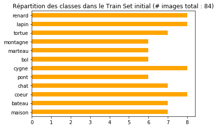
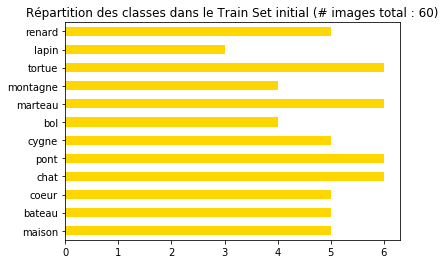
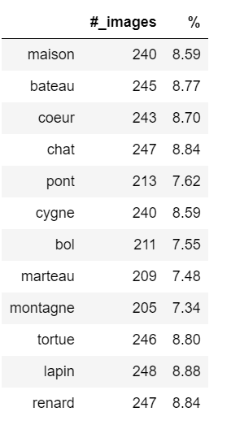
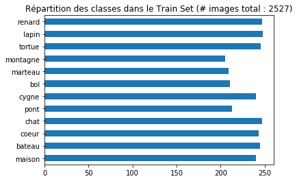
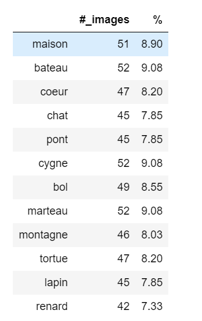
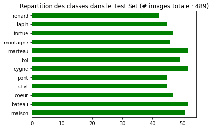
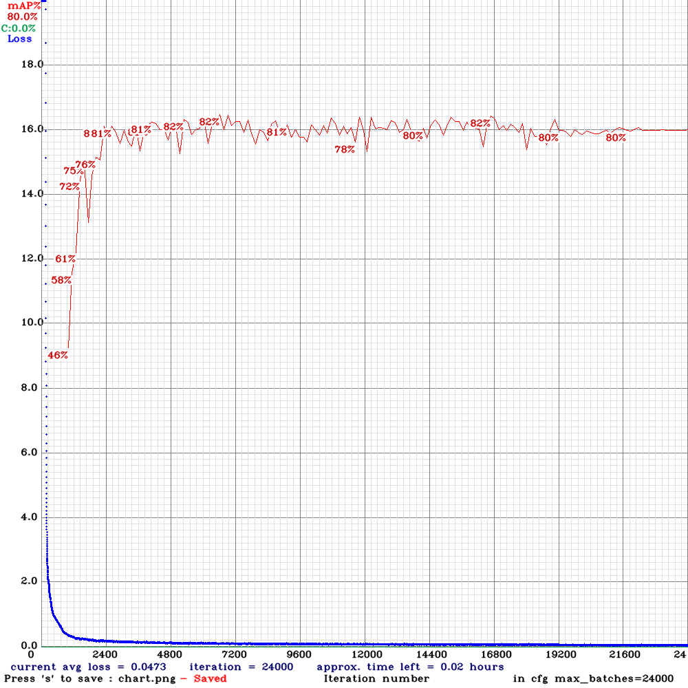
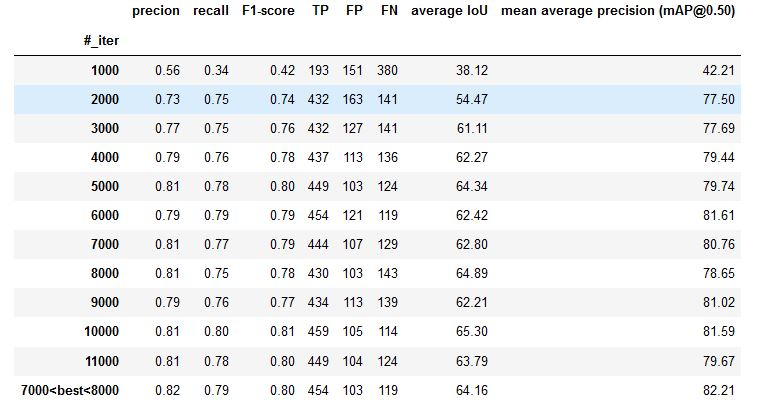
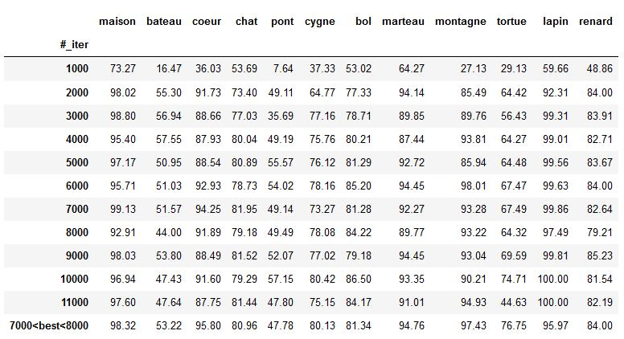

READ.ME


# Exploradome Project 
Exploradome's project is about an educational game for 6-year-old children. 

Their ambition is to awaken children's interest about the future with object recognition and computer vision in a fun and educational way through a tangram game.

Our duty is to design an algorithm which will be able to determine the percentage of completeness of the given figure. 

Thus the child will be able to see if he has more or less succeeded in achieving the figure he had to do.


Therefore Exploradome provided us with a camera as well as the game table with the 12 tangrams.


The tangrams are made with 7 parts :

- 5 triangles, 

- 1 square, 

- and 1 parallelogram


When you put them together, it creates 12 shapes :

boat(bateau), bowl(bol), cat(chat), heart(coeur), swan(cygne), rabbit(lapin), house(maison), hammer(marteau), mountain(montagne), bridge(pont), fox(renard), turtle(tortue)


## Objective

The objective of this project is to train a YOLO v4 model to recognize in real time the realization of tangram (record in live and make by children) and to make predictions on the realized shapes.

# Dataset Creation 

## 1. Video recording :

The first step was to create our image classification, so we had to determine the 12 possible figures and annotate them. To do this, we decided to film continuously (using the camera provided by exploradome to respect the conditions under which the algorithm will be used) members of our team performing in turn the 12 possible figures.


## 2. Cut video into photos


For cutting the video into images, we proceeded in different ways:

- screenshots of the video with separate figures

- python code for cutting the video every 3 seconds then manual sorting

- video cutting test with the FreeVideo to JPG application (cut every 5 secondes)


Methods retained :

- screenshots and cutting with python and manual sorting


## 3. Image annotations

We tested 2 methods :

- labelImg (rectangle around the object)
- VIA VGG Image Annotator (object outlines)

Method adopted :

labelImg (graphical image annotation tool)

From the video we took screenshots of the classes in two versions, a perfect version of the figure and an imperfect version of the figure with the tangrams peeled off. Once done, we had to label our images. For that we used labelImg which is an image annotation tool. 


### Image annotations using labelImg 

#### Installation
So we used two ways to proceed :

1. Go through the source code following the tutorial available at this github link: https://github.com/tzutalin/labelImg)
2. Download the .exe and launch the application directly from desktop (download link https://tzutalin.github.io/labelImg/)

```python
#### Installation for Mac

brew install qt  # Install qt-5.x.x by Homebrew
brew install libxml2

or using pip

pip3 install pyqt5 lxml # Install qt and lxml by pip

make qt5py3
python3 labelImg.py
python3 labelImg.py [IMAGE_PATH] [PRE-DEFINED CLASS FILE]
```

```python
#### Installation for Windows

pyrcc4 -o lib/resources.py resources.qrc
For pyqt5, pyrcc5 -o libs/resources.py resources.qrc

python labelImg.py
python labelImg.py [IMAGE_PATH] [PRE-DEFINED CLASS FILE]
```


#### Labelling in YOLO text file format.
- In data/predefined_classes.txt define the list of classes that will be used for training.
- Launch labelImg.py.
- Right below “Save” button in the toolbar, click “PascalVOC” button to switch to YOLO format.
- Use Open/OpenDIR to process single or multiple images.
- When finished with a single image, click save.
    - A txt file of YOLO format will be saved in the same folder as the image with same name.
    - A file named “classes.txt” is saved to that folder too. “classes.txt” defines the list of class names that the YOLO label refers to.


## 4. Initial Dataset

Choice of images for the initial dataset of labeled images before data augmentation:

- 134 labeled images (all table + tangram alone) with their corresponding ".txt" files of YOLO format (label and bounding box coordinates) thanks to LabelImg

We splitted the dataset into training data and testing before appplying data augmentation :
- train : 76 images 
- test : 58 images 


<p align="center"></p>
<p align="center"></p>


## 5. Data augmentation 

Why is data augmentation needed?

Data augmentation is a strategy to increase the diversity of data available for training models, without actually collecting new data.


In order to train our model on a consistent dataset and avoid over-training, we decided to do a data augmentation with Roboflowai. For this, we used Roboflow which allows several transformations of the images, such as: blur, rotation, shear, exposure, brightness, noise, blur. 

Every group member did its own mix of transformation. 


We decide to split the dataset like : 80% for training dataset, and 20% for test dataset


### Steps

To import our images and bounding boxes in the YOLO Darknet format, we'll use Roboflow.

1. To get your data into Roboflow, create a free [Roboflow](https://app.roboflow.ai/) account.
2. Create Dataset using Object Detection (Bounding Box) as type.
3. Upload your images and their annotations in any format (VOC XML, COCO JSON, TensorFlow Object Detection CSV, etc).
4. Once uploaded, select a couple preprocessing steps. We recommend auto-orient and resize to 416x416
5. Add some Augmentation Options
6. Click "Generate"
7. Select YOLO Darknet as format and show download code
8. Choose any link to download via terminal or jupyter notebook


For our  training dataset we did five times different Augmentation Options to obtain more images.
- Flip (vertical and horizontal)
- 90° rotate (counter, clockwise, upside, down)
- rotation 45°
- Crop : 35% and 20% 
- Brightness : 45% and 20%
- Exposure: 15% and 7%
- Blur : 1.25px and 3.75 px
- Noise: 5px and 2px
- Crop: 20%, Rotation: 15°, Brightness: 25%: Exposure: 25%, Blur: 2px, Noise: 5px

For our  test dataset we did simple different Augmentation Options to obtain more images.
- Flip (vertical and horizontal)
- 90° rotate (counter, clockwise, upside, down)
- rotation 5°
- Exposure: 15% and 7%

### Dataset after data augmentation : 
3016 images : 

- 2527 images for the training dataset (~ 83%)
- 489 images for the test dataset (~ 17%)

<p></p>
<p></p>


# Training on our Tangram dataset : YOLOv4 vs YOLOv4 tiny 

## YOLOv4

For that purpose we used YOLOv4 Darknet (from AlexeyAB's Github repository) in the Cloud through Google Colab. We decided to work on Google Colab because it offers free gpu and the installation of yolov4 darknet is easy. We followed the step-by-step walkthrough tutorial of "the AI GUY" :
-  https://colab.research.google.com/drive/1_GdoqCJWXsChrOiY8sZMr_zbr_fH-0Fg?usp=sharing#scrollTo=qaONUTI2l4Sf
-  https://www.youtube.com/watch?v=mmj3nxGT2YQ
-  https://github.com/theAIGuysCode/YOLOv4-Cloud-Tutorial/tree/master/yolov4

Here is the Colab Notebook for showing how we trained our YOLOv4 Tangram detector : https://colab.research.google.com/drive/1mC3cBPB1w9W4tKD1ZAondm0pSfohXrzm?usp=sharing

In order to create a custom YOLOv4 detector we  needed the following:

- Labeled Custom Dataset in the yolo darknet format : each image need to have a corresponding txt file containning the label object following by the label object bounding box coordinates (ie : label coord_1 coord_2 coord_3 coord_4)
- Custom .cfg file
- obj.data and obj.names files
- train.txt file (test.txt is optional here as well)

### 1. Setting up

#### the cfg (configuration) file
We edit the cfg file named "yolov4-obj.cfg" based on how many classes we are training.
Following the recommandations of the tutorial we changed the first lines of the file as follow : 

```bash
batch = 64 
subdivisions = 16
width = 416 (our image width)
height = 416 (our image height)

max_batches = 24000   # ie :  (# of classes) * 2000 (but no less than 6000 so if you are training for 1, 2, or 3 classes it will be 6000, here detector for 12 classes gives a max_batches=24000) 
steps = 19200,21600  # ie: 80% of max_batches, 90% of max_batches (so here our max_batches = 24000)
```

We changed the classes = 12 in the three YOLO layers  (ie: line 970, line 1058 and line 1146) and filters = 51 in the three convolutional layers before the YOLO layers (ie: lines 963, 1051 and line 1139)

filters = (# of classes + 5) * 3 (so if you are training for one class then your filters = 18, but if you are training for 12 classes then your filters = 51)

**Optional:** If you run into memory issues or find the training taking a super long time. In each of the three yolo layers in the cfg, change one line from random = 1 to random = 0 to speed up training but slightly reduce accuracy of model. Will also help save memory if you run into any memory issues.

#### obj.names and obj.data files
- We created file called obj.names where we have one class name per line in the same order as our _darknet.labels file generated by roboflow. The order is like this:
```bash
maison
bateau
pont
cygne
bol
marteau
montagne
tortue
lapin
renard
coeur
chat
```


NOTE: You do not want to have spaces in the class names.

- We created a obj.data file. We changed the number of classes accordingly, as well as our backup location (this backup folder will serve to save the weights of the model at different iteration times of the training). We filled it in like this : 

```bash
classes = 12
train =  data/train.txt
valid =  data/test.txt
names = data/obj.names
backup = /mydrive/DeepL/Projet_tangram/backup
```

#### Generating train.txt and test.txt
The last configuration files needed before we can begin to train our custom detector are the train.txt and test.txt files which hold the relative paths to all our training images and valdidation images.

Luckily the AI GUY have created scripts that eaily generate these two files withe proper paths to all images.  The scripts are named generate_train.py and generate_test.py

We uploaded them to our Google Drive in  order to use them in the Colab Notebook.

### 2. Training 
We trained the model over more than 8000 iterations in several times (due to Colab deconnexion, it took ~ 2 days).  By saving yolov4-obj_"nb_iter".weights every 1000 iterations on our google drive backup folder, we would able to restart the training from our last saved weights with the file called yolov4-obj_last.weights.
We Checked the Mean Average Precision (mAP) of our Model. We runned this command on multiple of the saved weights to compare and find the weights with the highest mAP as that is the most accurate one.


Then the saved weight file that gave the highest mAP was used (MAP_yolov4_historic)

### 3.  MAP - Mean Average Precision 

As we can easily see on this table, we see that from 1000 to 4000 iterations an rise of all metrics used. Whereas, from 4000 to 6000 iterations we see a drop in our Mean Average Precision (MAP). By continuing we spot an increasing  until 0.97 for MAP (figure already reached at 4000 iterations). On all of our iterations, the best results obtained for the MAP are for a number of iterations between 3000 to 3800.


<p align="center"></p>


## YOLOv4 TINY
Tutorial :
- https://colab.research.google.com/drive/1PWOwg038EOGNddf6SXDG5AsC8PIcAe-G#scrollTo=nBnwpBV5ZXxQ
- https://blog.roboflow.ai/train-yolov4-tiny-on-custom-data-lighting-fast-detection/


We also train our model using yolov4 tiny. 
Performance metrics show that YOLOv4 tiny is roughly 8X as fast at inference time as YOLOv4 and roughly 2/3 as performant on MS COCO (a very hard dataset). On small custom detection tasks that are more tractable, you will see even less of a performance degradation. 

The primary difference between YOLOv4 tiny and YOLOv4 is that the network size is dramatically reduced. The number of convolutional layers in the CSP backbone are compressed. The number of YOLO layers are two instead of three and there are fewer anchor boxes for prediction. You can see the differences between the two networks for yourself in the config files:
- [yolov4-tiny.cfg](https://raw.githubusercontent.com/AlexeyAB/darknet/master/cfg/yolov4-tiny.cfg)
- [yolov4-tiny](https://raw.githubusercontent.com/AlexeyAB/darknet/master/cfg/yolov4.cfg)
  
### 1. Setting up
To train our model using yolov4 tiny, the steps are the same that previously just a fiew changes have to be made. 
- download the yolov4-tiny weights
````python
 #download the newly released yolov4-tiny weights
%cd /content/darknet
!wget https://github.com/AlexeyAB/darknet/releases/download/darknet_yolo_v4_pre/yolov4-tiny.weights
!wget https://github.com/AlexeyAB/darknet/releases/download/darknet_yolo_v4_pre/yolov4-tiny.conv.29
````
- configure the YOLOv4_tiny_config file : it is the same changes as previously excepted that we changed the classes = 12 in the two YOLO layers  (ie: line 220 and line 268) and filters = 51 in the two convolutional layers before the YOLO layers (ie: lines 212 and line 262). 
  
### 2. Training
We trained the model over 24000 iterations (it took 8 hours). We saved the yolov4-tiny-obj_"nb_iter".weights files every 1000 iterations on our google drive backup folder.

<p align="center" title="Test"></p>


### 3.  MAP - Mean Average Precision

We Checked the Mean Average Precision (mAP) of our Model. We runned this command on multiple of the saved weights to compare and find the weights with the highest mAP as that is the most accurate one.

Then the saved weight file that gave the highest mAP was used (MAP_yolov4_historic)

#### Train
<p align="center" title="Train"></p>

#### Test
<p align="center" title="Test"></p>

#### Precision per class on the test set
<p align="center"></p>

# FPS comparaison :  yolov4 vs yolov4-tiny

<p align="center"></p>

As we might guessed, the difference is obvious. Particularly due to the fact that the number of neuron layers is lower in the model yolov4-tiny as well as the image processing is opered in real time (over 25 fps the human's eyes make no difference). The config for the experience was : 1080 GTX for the GPU, i5-9600k for CPU and we got the same results with or without GPU.


