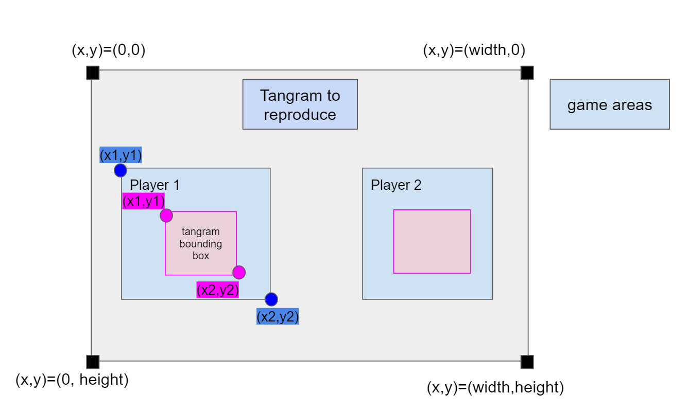
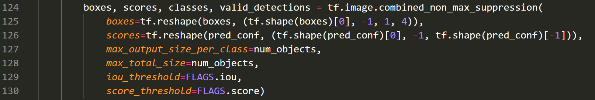
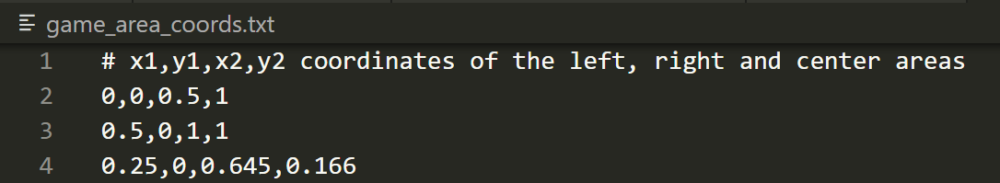

# TangrIAm Project 
The project is partnership between Exploradôme museum, OCTO Technology and Microsoft and it aims to introduce the concept and application of artificial intelligence to young children (6-year-old).

The specific application developed for the project is to apply object detection to live tangram solving.

A tangram is a dissection puzzle consisting of 7 flat polygons (5 triangles, 1 square and 1 parallelogram) which are combined to obtain a specific shape. 

Within the framework of the project, 12 tangram selected shapes act as classes for the object detector:

```bash
- boat (bateau)
- bowl (bol)
- bridge (pont) 
- cat (chat)
- fox (renard) 
- hammer (marteau) 
- heart (coeur)
- house (maison) 
- mountain (montagne) 
- rabbit (lapin)
- swan (cygne)
- turtle (tortue)
```

<p align="center"></p>

## Objective

The project objective is to train a YOLOv4 model to provide accurate predictions when identifying the detected shape of the tangram while live solving the puzzle.


### YOLOv4 tiny using TensorFlow 

**Note: Performance** Check out how YOLOv4 compares to other object detection systems
<p align="center"></p>
[](LICENSE)

To implement YOLOv4-tiny in Tensorflow 2.0, first convert YOLOv4 tiny .weights into the corresponding TensorFlow model (`.pb` format) and then run the model.

Here the different steps to do so:

## 1. Getting Started
### Cloning the "AI GUY" repository : https://github.com/theAIGuysCode/yolov4-custom-functions 
### Creating a working environnemnent 
#### Conda (Recommended)
```bash
# Tensorflow CPU
conda env create -f conda-cpu.yml
conda activate yolov4-cpu

# Tensorflow GPU
conda env create -f conda-gpu.yml
conda activate yolov4-gpu
```
#### Pip

```bash

# Create a pip env on the cloned githud folder
py -m pip install --user virtualenv
py -m venv yolov4-gpu
.\yolov4-gpu\Scripts\actvate # on windows

# TensorFlow CPU
pip install -r requirements.txt

# TensorFlow GPU
pip install -r requirements-gpu.txt
```

**Note** : If you are using GPU with CUDA 10.1 version. Install tensorflow-gpu==2.1.0 instead of tensorflow-gpu==2.3.0rc0 as written in the requirements-gpu.txt.


### Nvidia Driver (for GPU, if you are not using Conda Environment and have not set up CUDA yet)

Make sure to use CUDA Toolkit version 10.1 as it is the proper version for the TensorFlow version used in this repository: https://developer.nvidia.com/cuda-10.1-download-archive-update2


## Using custom trained YOLOv4 weights

<strong>Note:</strong>  To use our own weights:
- rename best weights file to 'custom.weights' and paste it into the 'data/' folder.

- Paste the custom.names file into the `data/classes/` folder : 
<p align="center"></p>

- Change line 14 of `core/config.py` file to point at the custom.names file:
<p align="center"></p>

**Note** <a href="https://github.com/Lucile-S/exploradome_tangram/blob/yolo---team1/data/custom.weights"> Here is the tiny yolov4 custom weight (`custom.weights`) file that is present in the ./data folder</a>

## 2. Convert darknet YOLOv4 tiny weights to TensorFlow 

```bash 
# custom.weights : finally selected weight file
python save_model.py --weights ./data/custom.weights --output ./checkpoints/custom-tiny-416 --input_size 416 --model yolov4  --tiny
```
The resulting `.pb` model is saved in the `./checkpoints/custom-tiny-416`  directory :
<p align="center"></p>

## 3. Run YOLO4 tiny TensorFlow model
### On image

```bash
# Run yolov4-tiny tensorflow model
python detect.py --weights ./checkpoints/custom-tiny-416 --size 416 --model yolov4 --images ./data/images/maison_3.png --tiny
```

### On video

```bash
# Run custom yolov4 model on video
python detect_video.py --weights ./checkpoints/custom-tiny-416 --size 416 --model yolov4 --video ./data/video/tangram_video.mp4 --output ./detections/results.avi --tiny
```
### On  webcam

```bash
# Run yolov4 on webcam
python detect_video.py --weights ./checkpoints/custom-tiny-416 --size 416 --model yolov4 --video 0 --output ./detections/results.avi --tiny
```

## 4.  Result Video

The output video will be saved wherever the --output flag points to. By default (in the absence of a flag), the video will not be saved.

<p align="center"></p>

**FPS** : around 25 FPS using GeForce (version 451.67) GPU on a Windows Surface laptop and xx using cpu

# Detailed Info About Tangram Detection : bounding box coordinates and classe probabilies

**Game table schematic representation**
<p align="center"></p>
<p align="center"> The table is divided into different areas : player 1 game area (to the left, "gauche"), player 2 game area (to the right, "droite") and a center area ("centre") where there is a picture representing the tangram to solve </p>

We created a custom  file `core/output.py` from witch functions are called by `detect_video.py` in order to keep track of detected tangram bounding box coordinates and classe probabilities at a given moment within video. At this point, the detection is performed over the whole table where the game takes place. 


We added to detect_video.py a custom flag called `output_file` in order to ouput an external file (named `./detections/boxes_and_predictions.txt`by default). 

This file contains, for each frame of the video, a list of dictionnaries (`object position and object prediction`) with detected trangram bounding box coordinates (upper left and  bottom right corner points --> x1, y1, x2, y2 format - in units of number of pixels) and associated classe probabilies. 


In addition, a flag  `sort_by`  allows to sort the predictions by descending order and to keep a specified number (`max_classes` variable) of classes.

Example of the output file from one frame with 2 tangrams detected using the `sort_by 5` option that returns the top 5 classe propabilies : 
```bash
python detect_video.py --weights ./checkpoints/custom-tiny-416 --size 416 --model yolov4 --video ./data/video/test_tangram_5.mp4  --tiny --sort_by 5
```

```
[{'object_position': {'x1': 237.0, 'y1': 331.0, 'x2': 558.0, 'y2': 596.0}, 'object_prediction': {'maison': 99.86477540058777, 'marteau': 0.0528011213493851, 'bol': 0.03359513523064186, 'montagne': 0.01354623555080417, 'coeur': 0.008174154976000441}}, {'object_position': {'x1': 1035.0, 'y1': 191.0, 'x2': 1361.0, 'y2': 489.0}, 'object_prediction': {'bateau': 92.25971970012176, 'montagne': 7.287678893676028, 'coeur': 0.1565047711833095, 'bol': 0.1486034053909359, 'renard': 0.05554839096459371}}] 
````
 Also, in order to test in a specific shorter video (<a href="https://github.com/Lucile-S/exploradome_tangram/blob/yolo---team1/data/video/test_tangram.mp4"> presents in the ./data/video folder</a>. 
 The Flag `num_objects` has been fixed to 2, it means that a maximum of two objects will be detected in the frame. In principle player 1 and player 2 tangrams. Nevertheless  because at the beginning of the solving the tangrams are just bunch of pieces, the detector will not be able to identified the tangram(s) and it will not generate any bounding boxes or put 2 boxes in the one that is was able to detect). It can be changed to 3 in order to detect the card representing the tangram to perform by both players. 
 <p align="center"></p>
 
## Filtering box coordinates according to game areas 
To retrieve the positions of the tangrams only if they are in the specific game areas (cf table picture above), we created `filter_game_areas` function within the file `core/output.py`. 
A file with  game area coordinates is provided as input. 
 <p align="center"></p>

A flag named `--margin` allow to define the number (k ; k=4 --> "hard margin" , k<4 --> "soft margin") of tangram bounding box corners that have to be in the area in order to be output.
The output is as follow : 
````
[{'gauche': {'object_position': {'x1': 301.0, 'y1': 230.0, 'x2': 639.0, 'y2': 586.0}, 'object_prediction': {'lapin': 98.87607766682285, 'cygne': 0.49678835172260666, 'maison': 0.2942448320389281, 'bateau': 0.2166774145916018, 'marteau': 0.04775600012048969}}, 'droite': {'object_position': {'x1': 961.0, 'y1': 180.0, 'x2': 1377.0, 'y2': 565.0}, 'object_prediction': {'cygne': 66.28505782195334, 'pont': 19.12538237734353, 'lapin': 14.447121557662122, 'bateau': 0.12717977641208805, 'renard': 0.014715905781852607}}, 'centre': None}] 
````


## Command line argument references

```bash
save_model.py:
  --weights: path to weights file
    (default: './data/yolov4.weights')
  --output: path to output
    (default: './checkpoints/yolov4-416')
  --[no]tiny: yolov4 or yolov4-tiny
    (default: 'False')
  --input_size: define input size of export model
    (default: 416)
  --framework: what framework to use (tf, trt, tflite)
    (default: tf)
  --model: yolov3 or yolov4
    (default: yolov4)

detect.py:
  --images: path to input images as a string with images separated by ","
    (default: './data/images/kite.jpg')
  --output: path to output folder
    (default: './detections/')
  --[no]tiny: yolov4 or yolov4-tiny
    (default: 'False')
  --weights: path to weights file
    (default: './checkpoints/yolov4-416')
  --framework: what framework to use (tf, trt, tflite)
    (default: tf)
  --model: yolov3 or yolov4
    (default: yolov4)
  --size: resize images to
    (default: 416)
  --iou: iou threshold
    (default: 0.45)
  --score: confidence threshold
    (default: 0.25)
    
detect_video.py:
  --video: path to input video (use 0 for webcam)
    (default: './data/video/video.mp4')
  --output: path to output video (remember to set right codec for given format. e.g. XVID for .avi)
    (default: None)
  --output_format: codec used in VideoWriter when saving video to file
    (default: 'XVID)
  --[no]tiny: yolov4 or yolov4-tiny
    (default: 'false')
  --weights: path to weights file
    (default: './checkpoints/yolov4-416')
  --framework: what framework to use (tf, trt, tflite)
    (default: tf)
  --model: yolov3 or yolov4
    (default: yolov4)
  --size: resize images to
    (default: 416)
  --iou: iou threshold
    (default: 0.45)
  --score: confidence threshold
    (default: 0.25)
```

# Google Drive link with the dataset and .weights files :
https://drive.google.com/drive/folders/1AKQij6dHRzsHOmonEeTcVZSX_WBiR7yP?usp=sharing


# References

  * tensorflow-yolov4-tflite [YOLOv4] from theAIGuysCode
  * (https://github.com/theAIGuysCode/tensorflow-yolov4-tflite)
  * YOLOv4: Optimal Speed and Accuracy of Object Detection [YOLOv4](https://arxiv.org/abs/2004.10934).
  * [darknet](https://github.com/AlexeyAB/darknet)
  * [Yolov3 tensorflow](https://github.com/YunYang1994/tensorflow-yolov3)
  * [Yolov3 tf2](https://github.com/zzh8829/yolov3-tf2)
