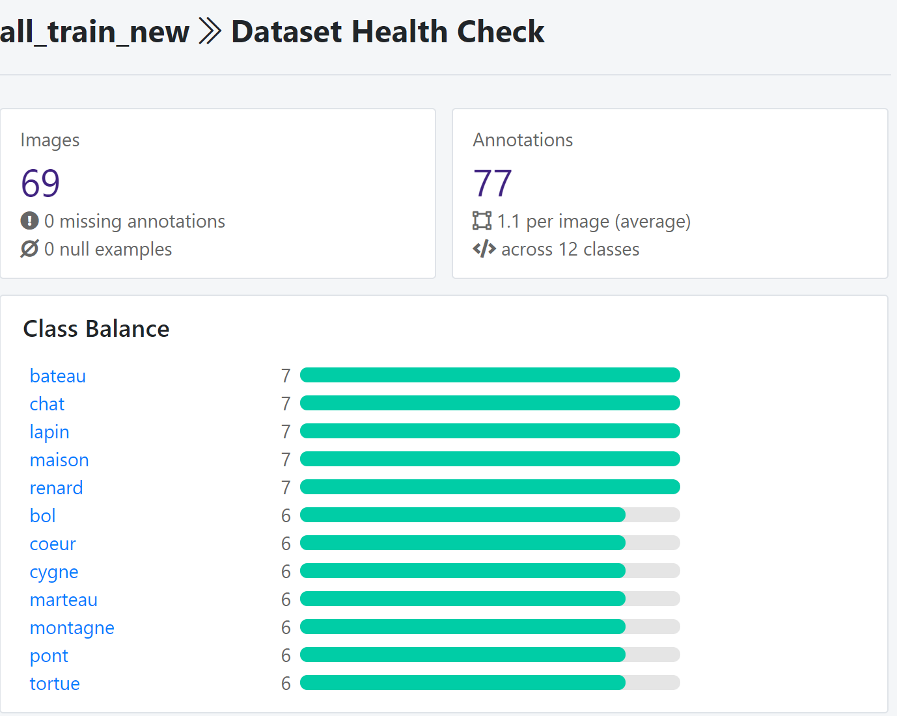
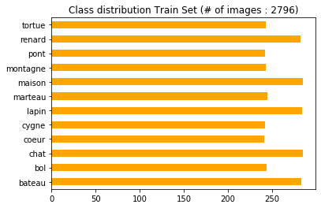
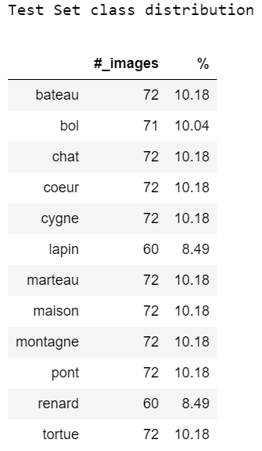
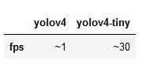

READ.ME


# TangrIAm Project 
The project is partnership between Exploradôme museum, OCTO Technology and Microsoft and it aims to introduce the concept and application of artificial intelligence to young children (6-year-old).
The specific application developed for the project is to apply object detection to live tangram solving.
A tangram is a dissection puzzle consisting of 7 flat polygons (5 triangles, 1 square and 1 parallelogram) which are combined to obtain a specific shape. 

Within the framework of the project, 12 tangram selected shapes act as classes for the object detector:

    • boat(bateau), 
    
    • bowl(bol), 
    
    • bridge(pont), 
    
    • cat(chat), 
    
    • fox(renard), 
    
    • hammer(marteau), 
    
    • heart(coeur), 
    
    • house(maison), 
    
    • mountain(montagne), 
    
    • rabbit(lapin), 
    
    • swan(cygne), 
    
    • turtle(tortue)


## Objective

The project objective is to train a YOLOv4 model to provide accurate predictions when identifying the detected shape of the tangram while live solving the puzzle. 

# Data 

## 1. Video recording :
The first step in collecting data was to record a video sample of tangram solving. 

## 2. From video stream to images


For cutting the video into images, we proceeded in different ways:

- screenshots of the video with separate figures

- python code for cutting the video every 3 seconds then manual sorting

- video cutting test with the FreeVideo to JPG application (cut every 5 secondes)


Methods retained :

- screenshots and cutting with python and manual sorting


## 3. Image annotations

We tested 2 methods :

- labelImg (rectangle around the object)
- VIA VGG Image Annotator (object outlines)

Method adopted :

labelImg (graphical image annotation tool)

From the video we took screenshots of the classes in two versions, a perfect version of the figure and an imperfect version of the figure with the tangrams peeled off. Once done, we had to label our images. For that we used labelImg which is an image annotation tool. 


### Image annotations using labelImg 

#### Installation
So we used two ways to proceed :

1. Go through the source code following the tutorial available at this github link: https://github.com/tzutalin/labelImg)
2. Download the .exe and launch the application directly from desktop (download link https://tzutalin.github.io/labelImg/)

```python
#### Installation for Mac

brew install qt  # Install qt-5.x.x by Homebrew
brew install libxml2

or using pip

pip3 install pyqt5 lxml # Install qt and lxml by pip

make qt5py3
python3 labelImg.py
python3 labelImg.py [IMAGE_PATH] [PRE-DEFINED CLASS FILE]
```

```python
#### Installation for Windows

pyrcc4 -o lib/resources.py resources.qrc
For pyqt5, pyrcc5 -o libs/resources.py resources.qrc

python labelImg.py
python labelImg.py [IMAGE_PATH] [PRE-DEFINED CLASS FILE]
```


#### Labelling in YOLO text file format.
- In data/predefined_classes.txt define the list of classes that will be used for training.
- Launch labelImg.py.
- Right below “Save” button in the toolbar, click “PascalVOC” button to switch to YOLO format.
- Use Open/OpenDIR to process single or multiple images.
- When finished with a single image, click save.
    - A txt file of YOLO format will be saved in the same folder as the image with same name.
    - A file named “classes.txt” is saved to that folder too. “classes.txt” defines the list of class names that the YOLO label refers to.


## 4. Initial Dataset

Choice of images for the initial dataset of labeled images before data augmentation:

- 134 labeled images (all table + tangram alone) with their corresponding ".txt" files of YOLO format (label and bounding box coordinates) thanks to LabelImg

We splitted the dataset into training data and testing before appplying data augmentation :
- train : 70 images 

<p align="center"></p>

- test : 59 images 
<p align="center"></p>

## 5. Data augmentation 

Why is data augmentation needed?

Data augmentation is a strategy to increase the diversity of data available for training models, without actually collecting new data.


In order to train our model on a consistent dataset and avoid over-training, we decided to do a data augmentation with Roboflowai. For this, we used Roboflow which allows several transformations of the images, such as: blur, rotation, shear, exposure, brightness, noise, blur. 

Every group member did its own mix of transformation. 


### Steps

To import our images and bounding boxes in the YOLO Darknet format, we'll use Roboflow.

1. To get your data into Roboflow, create a free [Roboflow](https://app.roboflow.ai/) account.
2. Create Dataset using Object Detection (Bounding Box) as type.
3. Upload your images and their annotations in any format (VOC XML, COCO JSON, TensorFlow Object Detection CSV, etc).
4. Once uploaded, select a couple preprocessing steps. We recommend auto-orient and resize to 416x416
5. Add some Augmentation Options
6. Click "Generate"
7. Select YOLO Darknet as format and show download code
8. Choose any link to download via terminal or jupyter notebook


For our  training  dataset, to obtain more images, we performed different augmentation options randomly applied to images  .
- Flip (vertical and horizontal)
- 90° rotate (counter, clockwise, upside, down)
- rotation every 5° up to 45°
- Crop : 20% 
- Brightness : 5% and 10%
- Exposure: 12% and 25%
- Blur : 3px and 1.25px
- Noise: 5px and 2px

For our  test dataset we did simple different Augmentation Options to obtain more images.
- Flip (vertical and horizontal)
- 90° rotate (counter, clockwise, upside, down)
- rotation 5°, 15° and 30%
- Brightness : 5% and 10%

### Dataset after data augmentation : 
3503 images in total: 

- 2796 images for the training dataset (~ 80%)
- 707 images for the test dataset (~ 20%)

<p></p>
<p></p>


# Training on our Tangram dataset : YOLOv4 vs YOLOv4 tiny 

## YOLOv4

For that purpose we used YOLOv4 Darknet (from AlexeyAB's Github repository) in the Cloud through Google Colab. We decided to work on Google Colab because it offers free gpu and the installation of yolov4 darknet is easy. We followed the step-by-step walkthrough tutorial of "the AI GUY" :
-  https://colab.research.google.com/drive/1_GdoqCJWXsChrOiY8sZMr_zbr_fH-0Fg?usp=sharing#scrollTo=qaONUTI2l4Sf
-  https://www.youtube.com/watch?v=mmj3nxGT2YQ
-  https://github.com/theAIGuysCode/YOLOv4-Cloud-Tutorial/tree/master/yolov4

Here is the Colab Notebook for showing how we trained our YOLOv4 Tangram detector : https://colab.research.google.com/drive/1mC3cBPB1w9W4tKD1ZAondm0pSfohXrzm?usp=sharing

In order to create a custom YOLOv4 detector we  needed the following:

- Labeled Custom Dataset in the yolo darknet format : each image need to have a corresponding txt file containning the label object following by the label object bounding box coordinates (ie : label coord_1 coord_2 coord_3 coord_4)
- Custom .cfg file
- obj.data and obj.names files
- train.txt file (test.txt is optional here as well)

### 1. Setting up
You can have a look at what configuration files you need to have in your local drive _`darknet`_ by looking this image (also available for yolov4)


You can download the cheat sheet [here](http://blog.ibanyez.info/download/B20190410T000000072.png)


#### the cfg (configuration) file
We edit the cfg file named "yolov4-obj.cfg" based on how many classes we are training.
Following the recommandations of the tutorial we changed the first lines of the file as follow : 

```bash
batch = 64 
subdivisions = 16
width = 416 (our image width)
height = 416 (our image height)

max_batches = 24000   # ie :  (# of classes) * 2000 (but no less than 6000 so if you are training for 1, 2, or 3 classes it will be 6000, here detector for 12 classes gives a max_batches=24000) 
steps = 19200,21600  # ie: 80% of max_batches, 90% of max_batches (so here our max_batches = 24000)
```

We changed the classes = 12 in the three YOLO layers  (ie: line 970, line 1058 and line 1146) and filters = 51 in the three convolutional layers before the YOLO layers (ie: lines 963, 1051 and line 1139)

filters = (# of classes + 5) * 3 (so if you are training for one class then your filters = 18, but if you are training for 12 classes then your filters = 51)

**Optional:** If you run into memory issues or find the training taking a super long time. In each of the three yolo layers in the cfg, change one line from random = 1 to random = 0 to speed up training but slightly reduce accuracy of model. Will also help save memory if you run into any memory issues.

#### obj.names and obj.data files
- We created file called obj.names where we have one class name per line in the same order as our _darknet.labels file generated by roboflow. The order is like this:
```bash
bateau
bol
chat
coeur
cygne
lapin
maison
marteau
montagne
pont
renard
tortue
```


NOTE: You do not want to have spaces in the class names.

- We created a obj.data file. We changed the number of classes accordingly, as well as our backup location (this backup folder will serve to save the weights of the model at different iteration times of the training). We filled it in like this : 

```bash
classes = 12
train =  data/train.txt
valid =  data/test.txt
names = data/obj.names
backup = /mydrive/DeepL/Projet_tangram/backup
```

#### Generating train.txt and test.txt
The last configuration files needed before we can begin to train our custom detector are the train.txt and test.txt files which hold the relative paths to all our training images and valdidation images.

Luckily the AI GUY have created scripts that eaily generate these two files withe proper paths to all images.  The scripts are named generate_train.py and generate_test.py

We uploaded them to our Google Drive in  order to use them in the Colab Notebook.

### 2. Training 
We trained the model over more than 8000 iterations in several times (due to Colab deconnexion, it took ~ 2 days).  By saving yolov4-obj_"nb_iter".weights every 1000 iterations on our google drive backup folder, we would able to restart the training from our last saved weights with the file called yolov4-obj_last.weights.
We Checked the Mean Average Precision (mAP) of our Model. We runned this command on multiple of the saved weights to compare and find the weights with the highest mAP as that is the most accurate one.


Then the saved weight file that gave the highest mAP was used (MAP_yolov4_historic)

### 3.  MAP - Mean Average Precision 

As we can easily see on this table, we see that from 1000 to 4000 iterations an rise of all metrics used. Whereas, from 4000 to 6000 iterations we see a drop in our Mean Average Precision (MAP). By continuing we spot an increasing  until 0.97 for MAP (figure already reached at 4000 iterations). On all of our iterations, the best results obtained for the MAP are for a number of iterations between 3000 to 3800.


<p align="center"></p>


## YOLOv4 TINY
Tutorial :
- https://colab.research.google.com/drive/1PWOwg038EOGNddf6SXDG5AsC8PIcAe-G#scrollTo=nBnwpBV5ZXxQ
- https://blog.roboflow.ai/train-yolov4-tiny-on-custom-data-lighting-fast-detection/


We also train our model using yolov4 tiny. 
Performance metrics show that YOLOv4 tiny is roughly 8X as fast at inference time as YOLOv4 and roughly 2/3 as performant on MS COCO (a very hard dataset). On small custom detection tasks that are more tractable, you will see even less of a performance degradation. 

The primary difference between YOLOv4 tiny and YOLOv4 is that the network size is dramatically reduced. The number of convolutional layers in the CSP backbone are compressed. The number of YOLO layers are two instead of three and there are fewer anchor boxes for prediction. You can see the differences between the two networks for yourself in the config files:
- [yolov4-tiny.cfg](https://raw.githubusercontent.com/AlexeyAB/darknet/master/cfg/yolov4-tiny.cfg)
- [yolov4-tiny](https://raw.githubusercontent.com/AlexeyAB/darknet/master/cfg/yolov4.cfg)
  
### 1. Setting up
To train our model using yolov4 tiny, the steps are the same that previously just a fiew changes have to be made. 
- download the yolov4-tiny weights
````python
 #download the newly released yolov4-tiny weights
%cd /content/darknet
!wget https://github.com/AlexeyAB/darknet/releases/download/darknet_yolo_v4_pre/yolov4-tiny.weights
!wget https://github.com/AlexeyAB/darknet/releases/download/darknet_yolo_v4_pre/yolov4-tiny.conv.29
````
- configure the YOLOv4_tiny_config file : it is the same changes as previously excepted that we changed the classes = 12 in the two YOLO layers  (ie: line 220 and line 268) and filters = 51 in the two convolutional layers before the YOLO layers (ie: lines 212 and line 262). 
  
### 2. Training
We trained the model over 24000 iterations (it took 5 hours). We saved the yolov4-tiny-obj_"nb_iter".weights files every 1000 iterations on our google drive backup folder.

<p align="center" title="Test"></p>


### 3.  MAP - Mean Average Precision

We Checked the Mean Average Precision (mAP) of our Model. We runned this command on multiple of the saved weights to compare and find the weights with the highest mAP as that is the most accurate one.

Then the saved weight file that gave the highest mAP was used (MAP_yolov4_historic)

#### Train
<p align="center" title="Train"></p>

#### Test
<p align="center" title="Test"></p>

#### Precision per class on the test set
<p align="center"></p>

# FPS comparaison :  yolov4 vs yolov4-tiny

<p align="center"></p>

As we might guessed, the difference is obvious. Particularly due to the fact that the number of neuron layers is lower in the model yolov4-tiny as well as the image processing is opered in real time (over 25 fps the human's eyes make no difference). The config for the experience was : 1080 GTX for the GPU, i5-9600k for CPU and we got the same results with or without GPU.


#  YOLOv4 and Yolov4 tiny using Tensorflow 
[](LICENSE)

YOLOv4, YOLOv4-tiny Implemented in Tensorflow 2.0. 
Convert YOLO v4, tiny .weights to .pb format for tensorflow.
<p align="center"></p>

## Getting Started
### Conda (Recommended)

```bash
# Tensorflow CPU
conda env create -f conda-cpu.yml
conda activate yolov4-cpu

# Tensorflow GPU
conda env create -f conda-gpu.yml
conda activate yolov4-gpu
```

### Pip
```bash

# Create a pip env on the cloned githud folder
py -m pip install --user virtualenv
py -m venv yolov4-gpu
.\yolov4-gpu\Scripts\actvate # on windows

# TensorFlow CPU
pip install -r requirements.txt

# TensorFlow GPU
pip install -r requirements-gpu.txt
```

**Note** : if you are using GPU with CUDA 10.1 version. Install tensorflow-gpu==2.1.0 instead of tensorflow-gpu==2.3.0rc0 as written in the requirements-gpu.txt


### Nvidia Driver (For GPU, if you are not using Conda Environment and haven't set up CUDA yet)
Make sure to use CUDA Toolkit version 10.1 as it is the proper version for the TensorFlow version used in this repository.
https://developer.nvidia.com/cuda-10.1-download-archive-update2

###  Performance
Check out how YOLOv4 compares to other object detection systems.

<p align="center"></p>


### Using Custom Trained YOLOv4 Weights

<strong>Note:</strong>  If you want to use  you own weights:
Copy and paste your custom .weights file into the 'data' folder and copy and paste your custom .names into the 'data/classes/' folder.
The only change within the code you need to make in order for your custom model to work is on line 14 of 'core/config.py' file.
Update the code to point at your custom .names file as seen below. (my custom .names file is called custom.names but yours might be named differently).

**Note** here it is the tiny yolov4 custom weight (custom.weights) file that is present in the ./data folder 

<p align="center"></p>

##  YOLOv4-tiny Using Tensorflow (tf, .pb model) 

### Step1 : Convert  darknet yolov4 tiny weights to tensorflow
```bash
# Convert darknet weights to tensorflow 
# custom.weights = yolo_tiny_best.weights
# custom tiny yolov4
python save_model.py --weights ./data/custom.weights --output ./checkpoints/custom-tiny-416 --input_size 416 --model yolov4  --tiny
```

### Step2 : run yolov4-tiny tensorflow model
##### On image
```bash
# STEP 2
# Run yolov4-tiny tensorflow model
python detect.py --weights ./checkpoints/custom-tiny-416 --size 416 --model yolov4 --images ./data/images/maison_3.png --tiny
```

##### On video
```bash
# Run custom yolov4 model on video
python detect_video.py --weights ./checkpoints/custom-tiny-416 --size 416 --model yolov4 --video ./data/video/tangram_video.mp4 --output ./detections/results.avi --tiny
```
##### On  webcam
```bash
# Run yolov4 on webcam
python detect_video.py --weights ./checkpoints/custom-tiny-416 --size 416 --model yolov4 --video 0 --output ./detections/results.avi --tiny
```

##  YoLOv4 Using Tensorflow (tf, .pb model)
To implement YOLOv4 using TensorFlow, first we convert the yolov4_best.weights into the corresponding TensorFlow model files and then run the model.

Use data/custom_yolov4.weights et change to custom.weights

### Step1 : Convert  darknet yolov4 weights to tensorflow
```bash
# Convert darknet weights to tensorflow
# custom yolov4 
# but if you want to use new weights, you will have to use this commande transform them to tensorflow 
python save_model.py --weights ./data/custom.weights --output ./checkpoints/custom-416 --input_size 416 --model yolov4 
```
### Step2 : run yolov4 tensorflow model
#### On image
```bash
# Run custom yolov4 tensorflow model 
python detect.py --weights ./checkpoints/custom-416 --size 416 --model yolov4 --images ./data/images/car.jpg
```
#### On video
```bash
# Run custom yolov4 model on video
python detect_video.py --weights ./checkpoints/custom-416 --size 416 --model yolov4 --video ./data/video/tangram_video.mp4 --output ./detections/results.avi
```
#### On webcam
```bash
# Run yolov4 on webcam
python detect_video.py --weights ./checkpoints/custom-416 --size 416 --model yolov4 --video 0 --output ./detections/results.avi
```
If you want to run yolov3 or yolov3-tiny change ``--model yolov3`` and .weights file in above commands.

<strong>Note:</strong> You can also run the detector on multiple images at once by changing the --images flag like such ``--images "./data/images/kite.jpg, ./data/images/dog.jpg"``

### Results 
#### Result Image(s) (Regular TensorFlow)
You can find the outputted image(s) showing the detections saved within the 'detections' folder.
#### Pre-trained YOLOv4 Model Example
<p align="center"></p>

#### Custom YOLOv4 Model Example (see video link above to train this model)
<p align="center"></p>

#### Result Video
Video saves wherever you point --output flag to. If you don't set the flag then your video will not be saved with detections on it.
<p align="center"></p>


## Command Line Args Reference

```bash
save_model.py:
  --weights: path to weights file
    (default: './data/yolov4.weights')
  --output: path to output
    (default: './checkpoints/yolov4-416')
  --[no]tiny: yolov4 or yolov4-tiny
    (default: 'False')
  --input_size: define input size of export model
    (default: 416)
  --framework: what framework to use (tf, trt, tflite)
    (default: tf)
  --model: yolov3 or yolov4
    (default: yolov4)

detect.py:
  --images: path to input images as a string with images separated by ","
    (default: './data/images/kite.jpg')
  --output: path to output folder
    (default: './detections/')
  --[no]tiny: yolov4 or yolov4-tiny
    (default: 'False')
  --weights: path to weights file
    (default: './checkpoints/yolov4-416')
  --framework: what framework to use (tf, trt, tflite)
    (default: tf)
  --model: yolov3 or yolov4
    (default: yolov4)
  --size: resize images to
    (default: 416)
  --iou: iou threshold
    (default: 0.45)
  --score: confidence threshold
    (default: 0.25)
    
detect_video.py:
  --video: path to input video (use 0 for webcam)
    (default: './data/video/video.mp4')
  --output: path to output video (remember to set right codec for given format. e.g. XVID for .avi)
    (default: None)
  --output_format: codec used in VideoWriter when saving video to file
    (default: 'XVID)
  --[no]tiny: yolov4 or yolov4-tiny
    (default: 'false')
  --weights: path to weights file
    (default: './checkpoints/yolov4-416')
  --framework: what framework to use (tf, trt, tflite)
    (default: tf)
  --model: yolov3 or yolov4
    (default: yolov4)
  --size: resize images to
    (default: 416)
  --iou: iou threshold
    (default: 0.45)
  --score: confidence threshold
    (default: 0.25)
```


# References

  
  * tensorflow-yolov4-tflite [YOLOv4] from theAIGuysCode
  * (https://github.com/theAIGuysCode/tensorflow-yolov4-tflite)

  * YOLOv4: Optimal Speed and Accuracy of Object Detection [YOLOv4](https://arxiv.org/abs/2004.10934).
  * [darknet](https://github.com/AlexeyAB/darknet)
  
  

  * [Yolov3 tensorflow](https://github.com/YunYang1994/tensorflow-yolov3)
  * [Yolov3 tf2](https://github.com/zzh8829/yolov3-tf2)
